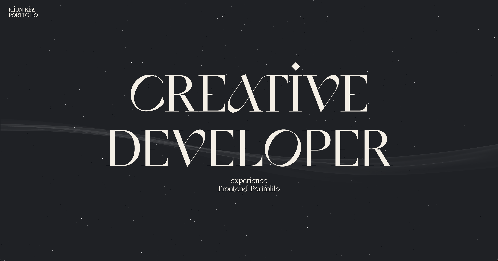
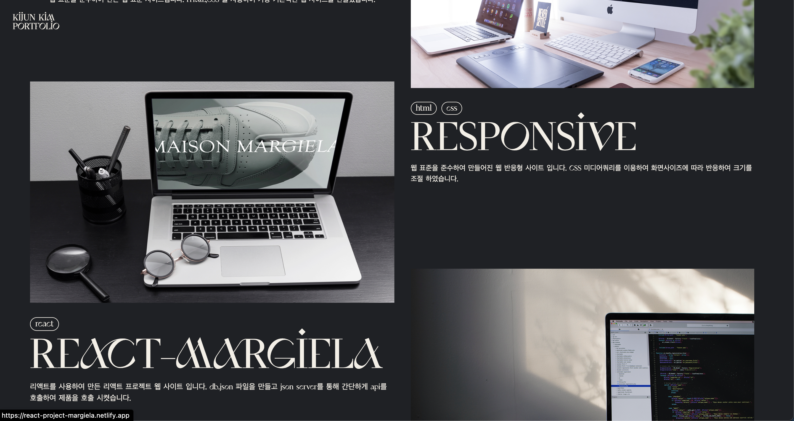

# 프론트엔드 포트폴리오 사이트

🏠[포트폴리오사이트 바로가기](https://applekimkijun.github.io/kijun-portfolio/) 
2022.03 ~ 제작중 
HTML, CSS, Javascript를 활용한 프론트엔드 포트폴리오 사이트 입니다. 

 

# GSAP를 활용한 스크롤 트리거

스크롤 Y값을 설정해서 각 세션에 효과를 부여 했습니다.

 

# 페이지 링크

현재까지 제작하였던 웹의 링크를 걸어두었습니다.

 

# Locomotive Scroll을 활용한 가로 스크롤 & JavaScript를 활용한 게임 링크

스크롤을 내릴때 섹션을 고정시키고 오른쪽으로 스크롤이 넘어가는 듯한 효과를 주었습니다.  
Javascript를 활용한 게임 링크를 만들었습니다.

 

# CSS를 활용한 3D 애니메이션

css를 활용해서 만든 3D 애니메이션 입니다.  
마우스를 텍스트에 올리면 각각의 애니메이션을 보실 수 있습니다.

